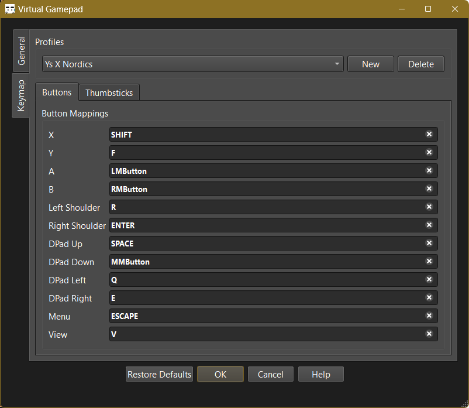

# FAQ

- this list will be replaced by the table of contents
{:toc}

## Which games do you play with this?

Mostly games that lack gamepad support.  
That includes older games and many indie games.

RPGs in particular are a good fit, as they often have simple controls and don't require quick reflexes.

Action games are also playable, but you better be prepared to practice.

## Any popular titles?

I've played [Assassin's Creed 4: Black Flag](https://en.wikipedia.org/wiki/Assassin's_Creed_IV%3A_Black_Flag), [Dave the Diver](https://en.wikipedia.org/wiki/Dave_the_Diver), [Ys X: Nordics](https://en.wikipedia.org/wiki/Ys_X:_Nordics), [Cassette Beasts](https://en.wikipedia.org/wiki/Cassette_Beasts) and [Dead Cells](https://en.wikipedia.org/wiki/Dead_Cells) with it.

## The default mapping doesn't work for me. What do I do?

You can:

1. Change the controls in-game, if the game supports it.
2. Use the profile editor in the server to remap the controls.

With a bit of remapping, almost everything is playable.  

You can find a few [sample profiles here](https://gist.github.com/kitswas/b7a100954de7dd7dcbe52cd38a27c8cf).

## Feels laggy/unresponsive

The server is not receiving your inputs fast enough.  
This is a symptom common to two different issues with different solutions.

$$\text{Max response time} = \text{Network delay} + \text{Polling interval}$$  
$$ \text{Min response time} = \text{Network delay}$$

_Processing time is negligible. I measured that in both apps (using v0.3.0) to find out._

### High polling interval

The mobile app samples the gamepad state at fixed intervals.  
You can change this in the app settings.

A lower polling interval will make the gamepad feel more responsive, but it will also increase the network traffic and battery usage.

On the flip side, it is easier to pull off combos with a higher polling interval.

> [!TIP]  
> Think automatic rifle (low polling interval) vs a pistol (high polling interval).

### High latency (Often the main culprit)

In plain English, this means that the network delay is too high.

Here's what I have observed (on 2.4GHz Wi-Fi):

1. **Direct connection (Hotspot on the phone or PC)** has the lowest latency (< 5ms)
2. **Router in the same room** has low latency (5-20ms)
3. Neighbour's router / router in a different room has higher latency (20-50ms)
4. Enterprise networks have the highest latency

Use 1 or 2 for the best experience.  
_The 5GHz WiFi band might provide better performance._

## You mentioned [cool upcoming features](Roadmap.md). When will they be available?

As soon as I have time to work on it. :)  
If you want them sooner, you can _contribute to the project_.

## Bug reports and feature requests?

Please open an issue on the Github issue tracker of the relevant repository:

- [VirtualGamePad-PC](https://github.com/kitswas/VirtualGamePad-PC/issues/new/choose)
- [VirtualGamePad-Mobile](https://github.com/kitswas/VirtualGamePad-Mobile/issues/new/choose)
- [VirtualGamePad Website](https://github.com/kitswas/VirtualGamePad/issues/new/choose)

If you are not sure which repository to use, just use the VirtualGamePad Website and I will move it to the right place.
