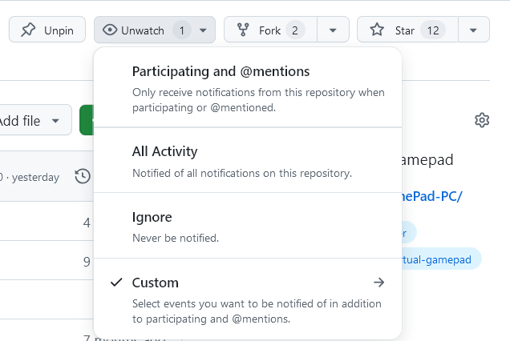

# VirtualGamePad

VirtualGamePad lets you use your Android phone as a gamepad for your PCs.  
It's similar to DroidJoy, but ***free*** and ***open-source***.

> **No ads, no tracking, no paywalls.**
{:.lead}

<video controls preload="metadata" width="1280" height="720">
  <source src="assets/VirtualGamePad.mp4" type="video/mp4">
  Sorry, your browser does not support embedded videos. Click here to view: [VirtualGamePad Intro video](assets/VirtualGamePad.mp4)
</video>

- this list will be replaced by the table of contents
{:toc}

## Benefits of using VirtualGamePad

- **Free and Open Source**: No ads, no tracking, no paywalls.
- **Secure**: The code is open for anyone to review. No need to trust a random app from who-knows-where.
- **Easy to Use**: Just install the app on your phone and download the portable server on your PC.
Connect via Wi-Fi ([or USB](FAQ.md#usb-connection)) and enjoy!
- **No Bloat**: The server is a portable app. No installation. No extra drivers (like vJoy) required.
- **Economical & Eco-friendly**: No need to buy a new gamepad. Use your old phone instead. Save money and reduce e-waste.

## Screenshots

VirtualGamePad running on an Android 12 device:

VirtualGamePad Server running on a PC:

## Installation

To use VirtualGamePad, you need to install the Android app (client) on your phone and download the portable PC app (server) on your PC.

To be notified of new updates, you can star ⭐ or watch 👁️ the source repositories on GitHub.

### Android

Available on F-Droid and GitHub.

Or, grab the latest APK from the [releases page](https://github.com/kitswas/VirtualGamePad-Mobile/releases) and install it on your phone.  

### Windows

Grab the latest archive(Virtual-GamePad-Windows.zip) from the [releases page](https://github.com/kitswas/VirtualGamePad-PC/releases), extract it and run `VGamepadPC.exe`.  
The experimental Gamepad Input mode has extra requirements, see the in-app description on the Preferences page.  

### Linux

Grab the latest archive(Virtual-GamePad-Ubuntu.zip) from the [releases page](https://github.com/kitswas/VirtualGamePad-PC/releases), extract it, `chmod +x bin/VGamepadPC` and `bin/VGamepadPC`.  
If Qt complains about 'xcb-cursor0 or libxcb-cursor0 is needed to load the Qt xcb platform plugin', `sudo apt install libxcb-cursor0` should fix it.  
See the in-app description on the Preferences page.  

We tested it on Ubuntu/Debian only. But it should work on other distributions as well.

## Usage

Run the server on your PC and the client on your phone.  
Connect to the server from the Android app by entering the IP address and port of the server.  
Both devices need to be on the same network.

[**Read the FAQ here**](FAQ.md).

Having problems? See the [Troubleshooting document](Troubleshooting.md).

## How it works

<video controls preload="metadata" width="1280" height="720">
  <source src="assets/VirtualGamePad_HowItWorks.mp4" type="video/mp4">
  Sorry, your browser does not support embedded videos. Click here to view: [VirtualGamePad Under the Hood](assets/VirtualGamePad_HowItWorks.mp4)
</video>

## Source Code

Glad you asked! VirtualGamePad is open source and licensed under the [GPLv3 licence](LICENCE.TXT).

VirtualGamePad uses open-source libraries and assets which are governed by their own licences.

The source code for the Android app is available at [kitswas/VirtualGamePad-Mobile](https://github.com/kitswas/VirtualGamePad-Mobile).

The source code for the Windows app is available at [kitswas/VirtualGamePad-PC](https://github.com/kitswas/VirtualGamePad-PC).  
Visit the [companion website](https://kitswas.github.io/VirtualGamePad-PC/) to see the documentation.

[kitswas/VGP_Data_Exchange](https://github.com/kitswas/VGP_Data_Exchange/) is used to handle the communication between the client and the server.

### Star History

<picture>
 <source media="(prefers-color-scheme: dark)" srcset="https://api.star-history.com/svg?repos=kitswas/VirtualGamePad,kitswas/VirtualGamePad-PC,kitswas/VirtualGamePad-Mobile&type=Date&theme=dark" />
 <source media="(prefers-color-scheme: light)" srcset="https://api.star-history.com/svg?repos=kitswas/VirtualGamePad,kitswas/VirtualGamePad-PC,kitswas/VirtualGamePad-Mobile&type=Date" />
 
</picture>
