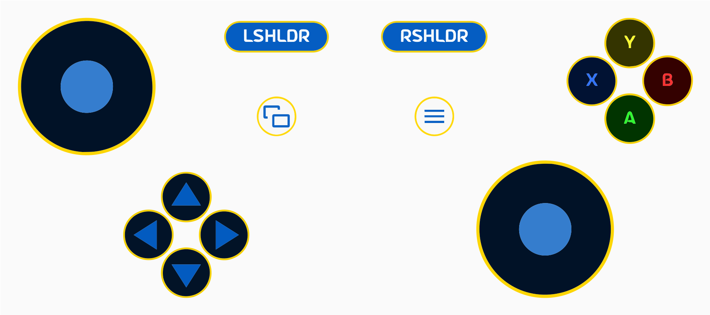
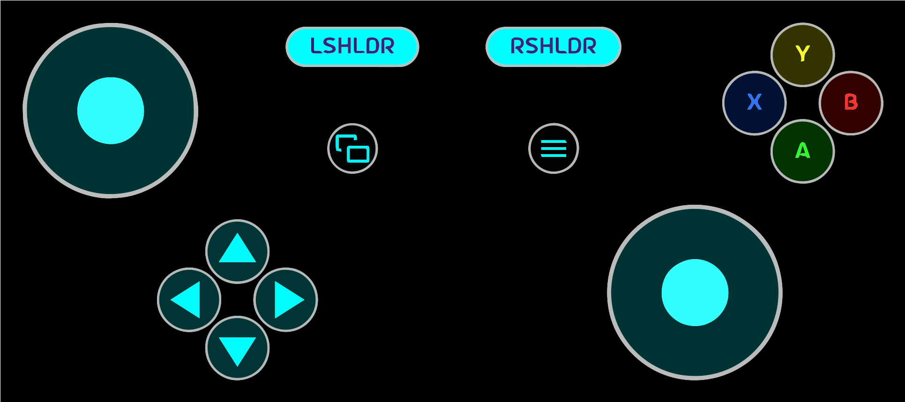
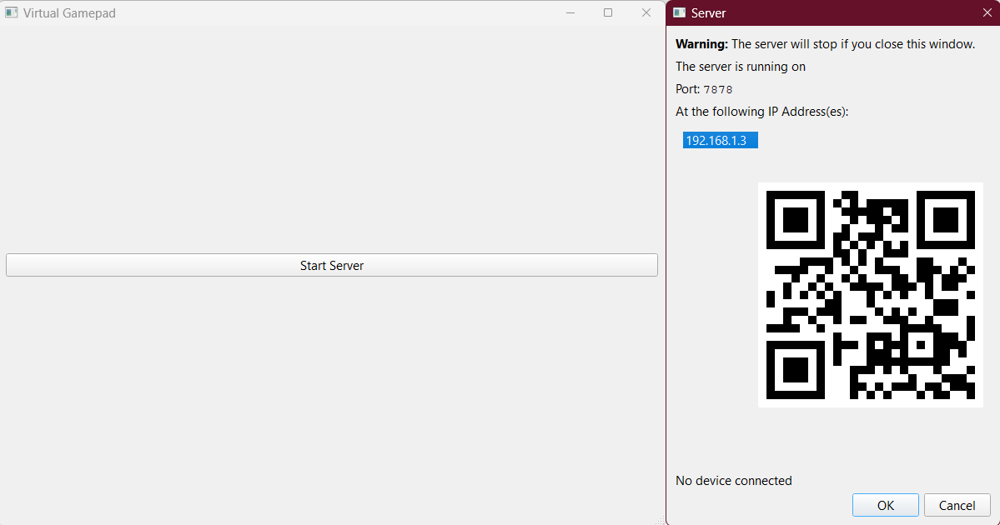

# VirtualGamePad

VirtualGamePad lets you use your Android phone as a gamepad for your Windows PC.  
It's similar to DroidJoy, but free and open source.

## Screenshots

VirtualGamePad running on an Android 12 device:

VirtualGamePad Server running on Windows 11:

## Installation

To use VirtualGamePad, you need to install the Android app (client) on your phone and the Windows app (server) on your PC.

### Android

Grab the latest APK from the [releases page](https://github.com/kitswas/VirtualGamePad-Mobile/releases) and install it on your phone.

### Windows

Grab the latest archive(.zip) from the [releases page](https://github.com/kitswas/VirtualGamePad-PC/releases), extract it and run `VGamepadPC.exe`.
