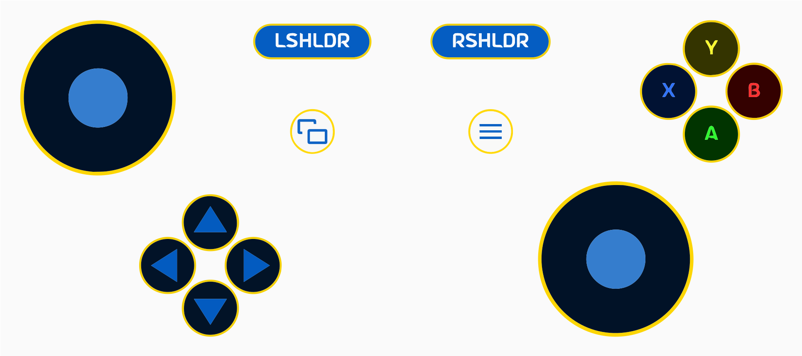
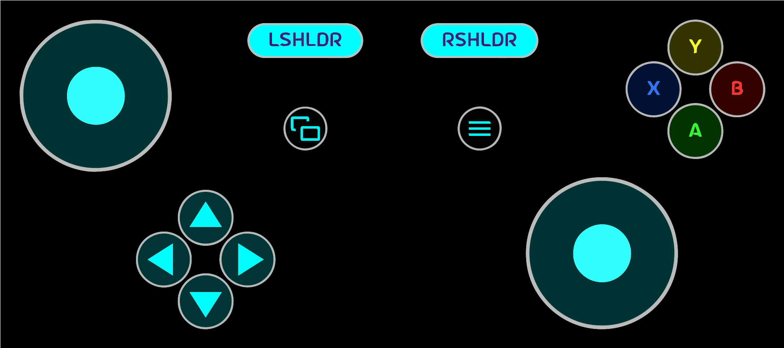
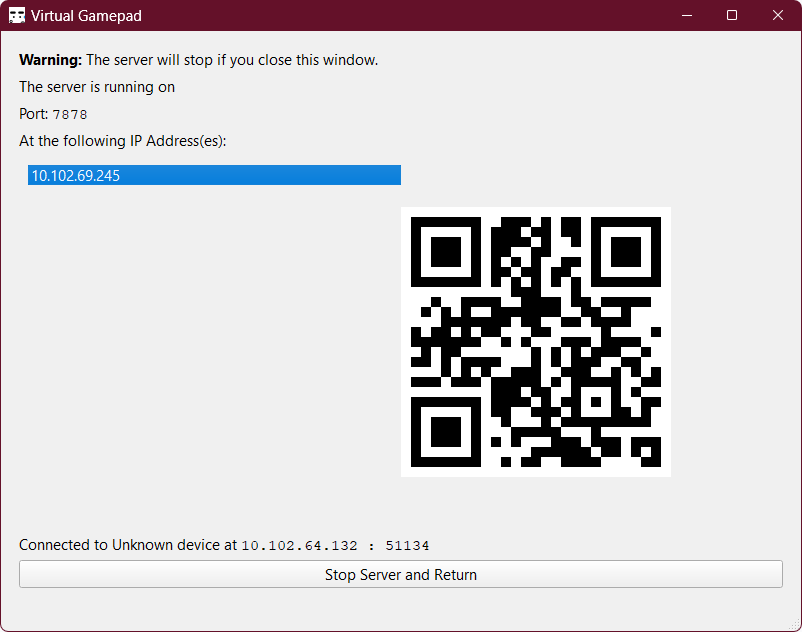
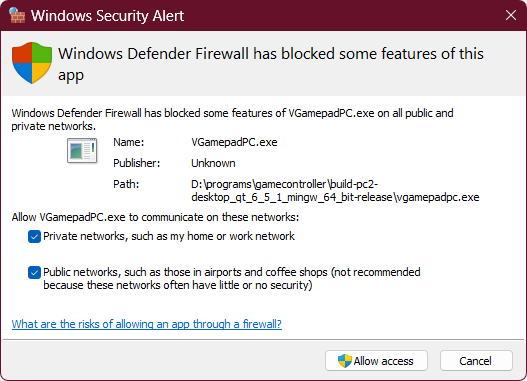

# VirtualGamePad

VirtualGamePad lets you use your Android phone as a gamepad for your Windows PC.  
It's similar to DroidJoy, but free and open source.

## Screenshots

VirtualGamePad running on an Android 12 device:

VirtualGamePad Server running on Windows 11:

## Installation

To use VirtualGamePad, you need to install the Android app (client) on your phone and the Windows app (server) on your PC.

### Android

Grab the latest APK from the [releases page](https://github.com/kitswas/VirtualGamePad-Mobile/releases) and install it on your phone.  

### Windows

Grab the latest archive(.zip) from the [releases page](https://github.com/kitswas/VirtualGamePad-PC/releases), extract it and run `VGamepadPC.exe`.  

## Usage

Run the server on your PC and the client on your phone.  
Connect to the server from the Android app by entering the IP address and port of the server.  
Both devices need to be on the same network.

There's an [**FAQ** for gamers](FAQ.md).

## Troubleshooting

If you're having trouble connecting to the server, try disabling your firewall or adding an exception for the server.  
On Windows, you will be prompted to allow the server to communicate through the firewall when you run it for the first time.

If you're still having trouble, start a hotspot on your phone and connect your PC to it.  
Then, restart the server and try connecting again.

The built-in QR code scanner might stop working after a while. This is [a known issue](https://stackoverflow.com/q/75661357/8659747) and caused by a bug in the Google library used for scanning. Clear the data for Google Play Services to fix it. Or use a third-party QR code scanner.

### Help! The Gamepad doesn't work for a game

If it is a newer title with built-in support for Gamepads on PC, you might face some problems.  
Try running the server as admin. 🛡️

**The game should not be running as admin.** This prevents input injection.

Games without gamepad support should work out of the box.

Read [How it works](https://kitswas.github.io/VirtualGamePad-PC/#how-it-works) to know why.

## Source Code

Glad you asked! VirtualGamePad is open source and licensed under the [GPLv3 licence](LICENCE.TXT).

VirtualGamePad uses open-source libraries and assets which are governed by their own licences.

The source code for the Android app is available at [kitswas/VirtualGamePad-Mobile](https://github.com/kitswas/VirtualGamePad-Mobile).

The source code for the Windows app is available at [kitswas/VirtualGamePad-PC](https://github.com/kitswas/VirtualGamePad-PC).  
Visit the [companion website](https://kitswas.github.io/VirtualGamePad-PC/) to see the documentation.

[kitswas/VGP_Data_Exchange](https://github.com/kitswas/VGP_Data_Exchange/) is used to handle the communication between the client and the server.
