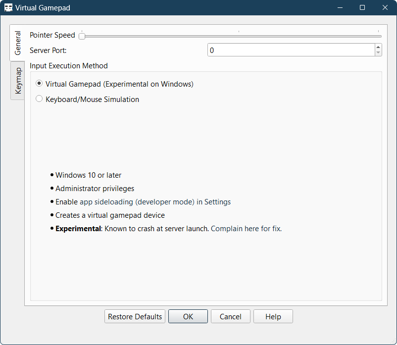
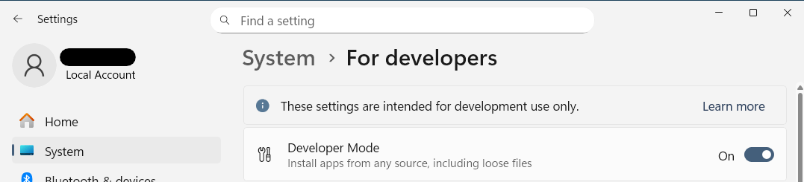
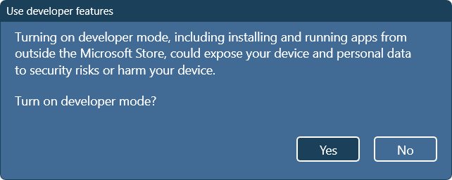

# Troubleshooting

If your problem is not covered here, [file an issue](FAQ.md#bug-reports-and-feature-requests).

- this list will be replaced by the table of contents
{:toc}

## Help! I cannot connect to the server

If you're having trouble connecting to the server, try disabling your firewall or adding an exception for the server.  
On Windows, you will be prompted to allow the server to communicate through the firewall when you run it for the first time.

**If you're still having trouble, start a hotspot on your phone and connect your PC to it.** (or vice-versa, try both)  
Then, restart the server and try connecting again.

_Do this before complaining about the app not working._

## Help! The client is connected but the Gamepad doesn't work for any game

Check the Preferences screen in the server. Different input methods (Keyboard/Mouse or Gamepad) have different requirements.

On Windows, the Keyboard/Mouse mode works out of the box. The Gamepad mode requires:

1. The admin privilege. (Right click and Run as admin)
2. App sideloading (developer mode) enabled. [(Settings > System > For developers > Developer mode)](ms-settings:developers).

  

On Linux, the server requires rw access to `/dev/uinput`. Multiple ways to achieve this are described in-app.

## Help! The Gamepad doesn't work for a game

Try running the server as admin. 🛡️

**The game should not be running as admin.** This prevents input injection.

Games without gamepad support should work out of the box.

Read [How it works](https://kitswas.github.io/VirtualGamePad-PC/#how-it-works) to know why.

## Help! The gamepad feels laggy/unresponsive

This is covered in [the FAQ.](FAQ.md#feels-laggyunresponsive)

## Bonus XKCD Comic

Tech Support Cheat Sheet — [XKCD 627](https://xkcd.com/627/):

